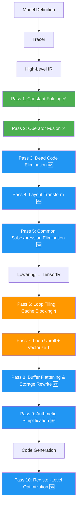

# Nâng cấp MLC Pipeline: Advanced Compiler Passes

Mục tiêu: Thêm các pass biến đổi nâng cao và cải thiện các pass hiện tại để framework thể hiện đầy đủ hơn những kỹ thuật tối ưu hóa mà MLC thực sự sử dụng. Mỗi pass được giải thích chi tiết về **tại sao** nó tồn tại, **cơ chế** hoạt động, và **hiệu quả** mang lại.

## Tổng quan: Pipeline hiện tại vs nâng cấp



> [!NOTE]
> ✅ = đã có | ⬆️ = nâng cấp | 🆕 = mới hoàn toàn

---

## Proposed Changes

### Component 1: High-Level IR Passes (Graph-Level)

Các pass này hoạt động trên biểu diễn High-Level IR (Relay-like), trước khi lowering xuống loop nests.

---

#### [NEW] `src/transform/dead_code_elimination.ts` — Dead Code Elimination (DCE)

**Tại sao cần?**
Sau khi constant folding và fusion, một số node IR không còn được consumer nào sử dụng (ví dụ: node trung gian bị bypass bởi fusion, hoặc backward nodes khi ta chỉ cần forward). DCE loại bỏ chúng, giảm kích thước IR và tránh lowering/codegen thừa.

**Cơ chế:**
1. Duyệt post-order toàn bộ expression tree
2. Xây dựng `useCount: Map<ExprId, number>` — đếm số lần mỗi node được tham chiếu
3. Loại bỏ các `LetExpr` mà `varName` có useCount = 0
4. Loại bỏ các `CallExpr` mà output không được sử dụng bởi node nào khác (trừ node cuối)

**Ví dụ:**
```text
Before DCE:
  %0 = nn.dense(%x, %w)        // used by %1
  %1 = nn.bias_add(%0, %b)     // used by %2 AND %3
  %2 = nn.relu(%1)             // used by %4 (output)
  %3 = nn.sigmoid(%1)          // NOT used by anyone! ← dead
  %4 = nn.dense(%2, %w2)       // output

After DCE:
  %0 = nn.dense(%x, %w)
  %1 = nn.bias_add(%0, %b)
  %2 = nn.relu(%1)
  %4 = nn.dense(%2, %w2)
```

---

#### [NEW] `src/transform/layout_transform.ts` — Data Layout Optimization

**Tại sao cần?**
Đây là một trong những pass quan trọng nhất của TVM/MLC. Mặc định weight tensor có layout `[N, K]` (row-major). Nhưng khi CPU truy cập dữ liệu theo inner loop `k`, nó cần đọc theo hàng của W. Nếu ta chuyển W sang layout `[N/bn, K, bn]` (packed layout), mỗi lần load từ cache line sẽ lấy được `bn` phần tử liên tục → tăng cache hit rate đáng kể.

**Cơ chế:**
1. Phân tích access pattern của mỗi buffer (đọc theo dimension nào)
2. Đề xuất layout transform: `[N, K] → [N/bn, K, bn]` cho weight, `[M, K] → [M, K/bk, bk]` cho input
3. Chèn `LayoutTransformNode` vào IR trước kernel
4. Cập nhật `BufferDecl.shape` và tất cả index expressions tương ứng

**Ví dụ:**
```text
Before (row-major W[N,K]):
  for j in [0, N):          // output feature
    for k in [0, K):        // reduction
      acc += A[i,k] * W[j,k]  // W access: stride-K jump between j iterations
                                // ← cache unfriendly when N is large

After (packed W[N/16, K, 16]):
  for j_outer in [0, N/16):
    for k in [0, K):
      for j_inner in [0, 16):
        acc[j_inner] += A[i,k] * W_packed[j_outer, k, j_inner]
        // W access: CONTIGUOUS! k increments hit same cache line
        // ← much better spatial locality
```

---

#### [NEW] `src/transform/cse.ts` — Common Subexpression Elimination (CSE)

**Tại sao cần?**
Trong backward pass, nhiều biểu thức giống nhau xuất hiện nhiều lần (ví dụ: `softmax(x)` cần tính `exp(x-max)` ở cả forward lẫn backward). CSE phát hiện và loại bỏ việc tính lặp.

**Cơ chế:**
1. Hash mỗi expression (op name + arg hashes) thành unique key
2. Duy trì `Map<hash, VarExpr>` cho các sub-expression đã gặp
3. Khi gặp expression có hash trùng → thay bằng reference đến kết quả đã tính
4. Wrap kết quả mới bằng `LetExpr` để đảm bảo tính đúng lúc

**Ví dụ:**
```text
Before CSE:
  %softmax = exp(x - max(x)) / sum(exp(x - max(x)))
  %grad = %softmax * (dY - sum(dY * %softmax))
  // exp(x - max(x)) computed TWICE, max(x) computed TWICE

After CSE:
  %t0 = max(x)
  %t1 = exp(x - %t0)          // shared
  %t2 = sum(%t1)
  %softmax = %t1 / %t2
  %grad = %softmax * (dY - sum(dY * %softmax))
```

---

### Component 2: TensorIR Passes (Loop-Level) — Nâng cấp + Mới

Các pass này hoạt động trên TensorIR (PrimFunc), biến đổi cấu trúc loop mà không thay đổi ngữ nghĩa tính toán.

---

#### [MODIFY] `src/transform/schedule.ts` — Nâng cấp Schedule Primitives

**Nâng cấp gì?**
1. **`cache_read` / `cache_write`**: Copy một tile của buffer vào vùng nhớ local trước khi tính toán, đảm bảo toàn bộ tile nằm trong L1 cache. Đây là kỹ thuật **cache blocking** thực sự.
2. **`compute_at`**: Di chuyển computation của một producer vào bên trong loop của consumer, giảm buffer allocation và tăng data reuse.
3. **`rfactor`**: Tách reduction loop thành parallel partial reductions rồi merge → cho phép parallel hóa reduction.

**Cơ chế `cache_read`:**
```text
Before cache_read:
  for j_outer in [0, N/32):
    for k in [0, K):
      for j_inner in [0, 32):
        acc[j_inner] += A[i,k] * W[j_outer*32+j_inner, k]

After cache_read(W, "local", [j_outer]):
  for j_outer in [0, N/32):
    // Stage: copy tile of W into local cache
    W_local = new Float32Array(32 * K)
    for k in [0, K):
      for j_inner in [0, 32):
        W_local[k*32+j_inner] = W[j_outer*32+j_inner, k]
    // Compute: use local cache
    for k in [0, K):
      for j_inner in [0, 32):
        acc[j_inner] += A[i,k] * W_local[k*32+j_inner]  // ← L1-resident!
```

**Cơ chế `rfactor`:**
```text
Before rfactor:
  acc = 0
  for k in [0, 1024):   // ← sequential reduction, cannot parallelize
    acc += A[k] * B[k]

After rfactor(k, 4):
  partial = new Float32Array(4)    // one per thread
  for k_outer in [0, 4):    // ← parallel!
    partial[k_outer] = 0
    for k_inner in [0, 256):
      partial[k_outer] += A[k_outer*256+k_inner] * B[k_outer*256+k_inner]
  // Final merge
  acc = partial[0] + partial[1] + partial[2] + partial[3]
```

---

#### [NEW] `src/transform/storage_rewrite.ts` — Buffer Flattening & Storage Optimization

**Tại sao cần?**
Sau schedule transforms, nhiều buffer local chỉ cần 1 phần tử (scalar) nhưng vẫn được allocate dạng array. Storage rewrite phát hiện và tối ưu:

1. **Scalar promotion**: `acc[0]` → biến scalar `let acc = 0` (tránh array overhead)
2. **Buffer sharing**: Nếu hai local buffer không overlap lifetime → share cùng vùng nhớ
3. **Inline allocation**: Di chuyển alloc vào sát nơi sử dụng (reduce scope)

**Cơ chế:**
1. Phân tích lifetime (first-write → last-read) của mỗi buffer
2. Buffer size 1 → promote thành scalar variable
3. Xây dựng interference graph giữa buffer lifetimes
4. Graph coloring: non-interfering buffers share storage

**Ví dụ:**
```text
Before:
  const acc = new Float32Array(1);     // array allocation!
  const tmp = new Float32Array(1);     // another allocation!
  for i:
    acc[0] = 0;                         // array indexing overhead
    for k: acc[0] += ...
    tmp[0] = acc[0] + bias;
    Out[i] = relu(tmp[0]);

After storage_rewrite:
  for i:
    let acc = 0;                        // scalar! no array overhead
    for k: acc += ...
    acc = acc + bias;                   // reuse same scalar (tmp eliminated)
    Out[i] = relu(acc);
```

---

#### [NEW] `src/transform/arithmetic_simplify.ts` — Arithmetic Simplification

**Tại sao cần?**
Sau split/reorder, index expressions trở nên phức tạp: `(j_outer * 32 + j_inner) * 784 + (k_outer * 56 + k_inner)`. Nhiều biểu thức chứa `* 1`, `+ 0`, hoặc có thể rút gọn.

**Cơ chế — Rewrite rules:**
```text
Canonicalization:
  x + 0      →  x
  x * 1      →  x
  x * 0      →  0
  0 + x      →  x
  x - 0      →  x
  x / 1      →  x

Strength reduction:
  x * 2      →  x + x         (shift/add faster than multiply)
  x * 2^n    →  x << n        (bit shift)
  x / 2^n    →  x >> n
  x % 2^n    →  x & (2^n-1)   (bitmask)

Constant folding in indices:
  3 * 4 + 2  →  14            (compile-time eval)
  
Distributive law:
  (a + b) * c  →  a*c + b*c   (when beneficial for CSE)
```

**Ví dụ (index expression):**
```text
Before:  Out[i * 1 + ((j_outer * 32 + j_inner) * 1)]
After:   Out[i + j_outer * 32 + j_inner]
```

---

### Component 3: Code Generation Enhancements

---

#### [MODIFY] `src/codegen/js_codegen.ts` — Register-Level Optimization

**Nâng cấp:**
1. **Register tiling**: Thay vì tính 1 output element per inner loop iteration, tính 4 cùng lúc (4 accumulators). Giảm loop overhead 4x, tăng instruction-level parallelism.
2. **Scalar replacement**: Convert `acc[0]` thành `let acc = 0` trong generated code (phối hợp với storage_rewrite pass).
3. **Prefetch hints**: Chèn comment/annotation cho `W[j+1]` access trước khi cần (conceptual, vì JS không có prefetch, nhưng thể hiện ý tưởng).

**Ví dụ register tiling:**
```javascript
// Before (1 accumulator):
for (let j = 0; j < 256; j++) {
  let acc = 0;
  for (let k = 0; k < 784; k++) {
    acc += A[k] * W[j * 784 + k];
  }
  Out[j] = acc;
}

// After (4-way register tiling):
for (let j = 0; j < 256; j += 4) {
  let acc0 = 0, acc1 = 0, acc2 = 0, acc3 = 0;
  for (let k = 0; k < 784; k++) {
    const a = A[k];        // load once, reuse 4 times!
    acc0 += a * W[(j+0) * 784 + k];
    acc1 += a * W[(j+1) * 784 + k];
    acc2 += a * W[(j+2) * 784 + k];
    acc3 += a * W[(j+3) * 784 + k];
  }
  Out[j] = acc0; Out[j+1] = acc1; Out[j+2] = acc2; Out[j+3] = acc3;
}
```

---

### Component 4: Analysis Passes (Read-Only)

Các pass này không biến đổi IR mà chỉ phân tích và báo cáo thông tin hữu ích.

---

#### [NEW] `src/analysis/memory_planner.ts` — Memory Planning & Analysis

**Chức năng:**
1. Tính tổng memory footprint cho mỗi PrimFunc
2. Phân tích data reuse ratio (bao nhiêu byte đọc vs bao nhiêu FLOP)
3. Ước lượng arithmetic intensity (FLOP/byte) → quyết định compute-bound vs memory-bound
4. Đề xuất tile sizes dựa trên cache size estimate

**Output:**
```text
Memory Analysis for fused_dense_bias_relu:
  Total buffer size: 803,584 bytes (785 KB)
    A[1,784]:    3,136 B (input)
    W[256,784]: 802,816 B (weight) ← dominates!
    B[1,256]:    1,024 B (bias)
    Out[1,256]:  1,024 B (output)
  
  FLOP count: 401,408 (256*784*2 + 256)
  Memory traffic: 803,584 bytes (naive)
  Arithmetic intensity: 0.50 FLOP/byte ← MEMORY-BOUND!
  
  With tiling (j=32, k=64):
    Working set: 32*64*4 = 8,192 bytes ← fits in L1 (32KB)!
    Effective AI: 3.2 FLOP/byte ← 6.4x improvement
```

---

#### [NEW] `src/analysis/op_profiler.ts` — Per-Op Profiling & Roofline Model

**Chức năng:**
Chạy benchmark cho từng kernel rồi plot trên Roofline model (text-based):
- X-axis: arithmetic intensity (FLOP/byte)
- Y-axis: achieved GFLOPS
- Roof: peak compute vs peak memory bandwidth

```text
Roofline Analysis:
  Peak compute:  ~10 GFLOPS (JS/V8 estimate)
  Peak BW:       ~20 GB/s (estimate)
  Ridge point:   0.5 FLOP/byte

  fused_dense_bias_relu:
    AI=0.50  Achieved=1.2 GFLOPS  [■■■░░░░░░░] 12% peak  ← memory-bound
  fused_dense_bias:
    AI=0.08  Achieved=0.3 GFLOPS  [■░░░░░░░░░]  3% peak  ← severely memory-bound
```

---

## Thứ tự thực hiện

| Phase | Pass | File | Độ phức tạp |
|-------|------|------|-------------|
| 1 | Dead Code Elimination | `transform/dead_code_elimination.ts` | Thấp |
| 2 | Arithmetic Simplification | `transform/arithmetic_simplify.ts` | Trung bình |
| 3 | Common Subexpression Elimination | `transform/cse.ts` | Trung bình |
| 4 | Storage Rewrite (scalar promotion) | `transform/storage_rewrite.ts` | Trung bình |
| 5 | Memory Planner (analysis) | `analysis/memory_planner.ts` | Thấp |
| 6 | Schedule upgrades (cache_read, rfactor, compute_at) | `transform/schedule.ts` | Cao |
| 7 | Layout Transform | `transform/layout_transform.ts` | Cao |
| 8 | Register Tiling (codegen) | `codegen/js_codegen.ts` | Trung bình |
| 9 | Op Profiler / Roofline | `analysis/op_profiler.ts` | Thấp |
| 10 | Integration vào `main.ts` | `main.ts` | Trung bình |

---

## Verification Plan

### Automated Tests
- Sau mỗi pass, verify output bằng cách so sánh compiled result với naive NDArray computation (giống flow hiện tại)
- Chạy `npx tsx src/main.ts` cuối cùng để verify full pipeline với tất cả pass mới

### Manual Verification
- In IR trước/sau mỗi pass mới để trực quan thấy sự biến đổi
- So sánh benchmark numbers trước/sau để thấy speedup thực tế
- Kiểm tra generated JS code có đúng semantic

---

## Open Questions

> [!IMPORTANT]
> 1. Bạn muốn tất cả 10 pass trên hay chọn một số pass ưu tiên? 
> 2. Có muốn thêm phần print/visualization chi tiết cho mỗi pass (trước/sau) trong `main.ts` output không? (Tôi recommend có, vì mục đích học hỏi)
> 3. Auto-tuner hiện tại chỉ search tile sizes. Có muốn nâng cấp lên evolutionary search (simulated annealing) không?
